<div align="center">

# ABA-Setup

**Schreib deine abschließende Arbeit mit Claude oder ChatGPT.**<br/>
Schritt für Schritt, belegt und offengelegt.

[](LICENSE)
[](LICENSE)
[](https://www.ahs-aba.at)
[](fuer-die-app/ANLEITUNG.md)
[](#stand-und-pflege)

[Starten](#starten) · [Die vier Regeln](#die-vier-regeln) · [Was drin ist](#was-drin-ist) · [Fahrplan](FAHRPLAN.md) · [Erste Schritte](START-HIER.md)

</div>

<picture>
  <source media="(prefers-color-scheme: dark)" srcset=".github/assets/banner-dark.svg">
  
</picture>

Die abschließende Arbeit (ABA, früher VWA) darf mit KI geschrieben werden – das
Bildungsministerium stellt ausdrücklich fest: „Ein generelles Verbot von
KI-Tools im Rahmen der abschließenden Arbeit ist nicht zulässig.“ Erlaubt ist sie
unter drei Bedingungen: **dokumentiert, kritisch reflektiert, weiterverarbeitet.**

Ein nacktes Chatfenster erfüllt keine davon. Es erfindet Literaturangaben,
schreibt Absätze, die niemand verteidigen kann, und führt kein Protokoll. Dieses
Setup ändert den Standardzustand: **fünfzehn Regelwerke mit Fundstellen, neun
Arbeitsschritte und vier Regeln** – damit die KI mit dir schreibt, ohne Quellen zu
erfinden, und alles so festhält, wie es die Prüfungsordnung verlangt.

Du gibst Claude oder ChatGPT den Ordner, bekommst drei kurze Fragen – und dann
arbeitet ihr an deiner Arbeit.

---

## Starten

### Mit Claude Code (empfohlen)

Den Ordner holen – per `git clone` oder auf dieser Seite **Code → Download ZIP**
und entpacken. Dann den Ordner in Claude Code öffnen (Desktop-App oder Terminal)
und schreiben:

> Lass uns starten.

Claude stellt drei kurze Fragen, trägt die Antworten in `mein/profil.md` ein und
macht sofort einen ersten echten Schritt an deiner Arbeit. Kein Einrichten von
Hand. Profil, Begleitprotokoll und die Liste der KI-Stellen schreibt Claude selbst
mit.

```bash
git clone https://github.com/nikolajhh2008-svg/aba-setup.git
cd aba-setup
claude
```

### In der App – Claude oder ChatGPT, ohne Installation

Ein Projekt anlegen, einen vorbereiteten Text in die Anweisungen kopieren, fünf
Dateien hochladen. Funktioniert auch im Gratis-Tarif. Schritt für Schritt:
**[fuer-die-app/ANLEITUNG.md](fuer-die-app/ANLEITUNG.md)**.

### Mit einem anderen KI-Dienst

Die Regelwerke sind gewöhnliche Textdateien. Sie wirken überall, wo man Dateien
hochladen oder Anweisungen hinterlegen kann – was sie sagen, gilt unabhängig
davon, welches Modell sie liest.

---

## Die vier Regeln

**1. Keine erfundenen Quellen.** Kein Titel, kein Jahr, keine Seitenzahl ohne
Deckung. In einer Untersuchung von 636 modellerzeugten Literaturangaben waren je
nach Modell 18 bis 55 Prozent vollständig erfunden
([Walters & Wilder 2023](https://www.nature.com/articles/s41598-023-41032-5)).
Hier gibt es stattdessen Kataloge, Suchbegriffe – und im Entwurf eine markierte
Lücke, bis die Quelle da ist.

**2. Geschrieben wird mit dir, Absatz für Absatz.** Erst Leitfrage, Quellen mit
Seitenzahl und deine Aussage in einem Satz, dann der Plan des Kapitels, dann ein
Absatz nach dem anderen – jeweils mit einer Rückfrage an dich. Sieben der
dreizehn Beurteilungskriterien werden mündlich geprüft; einen Absatz, den du
mitgebaut hast, kannst du verteidigen.

**3. Guter Text statt generischer.** Jeder Entwurf wird vor dem Zeigen gegen
eine Prüfliste gehalten: keine Floskeln, keine Verstärkerwörter, keine
Dreierketten, kein „—“, kein Schlusssatz, der nur wiederholt. Konkret,
wissenschaftlich, österreichisches Standarddeutsch.

**4. Alles wird offengelegt.** Jede Stelle aus einem Entwurf landet in
`mein/ki-stellen.md`, jede Sitzung im Begleitprotokoll. Vor der Abgabe wird
daraus die Kennzeichnung, die die amtliche FAQ verlangt. Genau das macht die
Nutzung erlaubt – verschwiegene KI-Hilfe gilt als vorgetäuschte Leistung.

---

## Was drin ist

```
CLAUDE.md               Die Betriebsanweisung – liest Claude bei jedem Start
FAHRPLAN.md             Sieben Etappen von der Idee bis zur Diskussion
START-HIER.md           Für alle, die noch nie mit Claude gearbeitet haben

regeln/                 15 Regelwerke mit Fundstellen, dazu ein Register
mein/                   Deine Dateien: Profil, Schulvorgaben, Protokoll, Quellen
werkzeuge/              text-pruefen.py zählt nach, was nachzählbar ist;
                        buendeln.py und paket-pruefen.py halten das Setup stimmig
.claude/skills/         Die neun Arbeitsschritte
fuer-die-app/           Einrichtung für Claude- oder ChatGPT-App
```

**Die Regelwerke** decken ab, was bei der ABA tatsächlich zählt: Thema und
Leitfragen · Aufbau · Methodik · Fristen und Abgabe · Recherchewege und seriöse
Quellen · Quellen und Zitieren · Zitierstile · Plagiat und Eigenleistung ·
wissenschaftliche Schreibweise · Schreibhandwerk · Sprachprüfung ·
KI-Kennzeichnung · Begleitprotokoll · Beurteilung · Präsentation und Diskussion.
Belegt an Prüfungsordnung, SchUG, der amtlichen FAQ und dem Beurteilungsraster.

**Die Arbeitsschritte** – normale Sätze funktionieren genauso, aber diese Wörter
treffen direkt:

- `start` – Einstieg, oder „wo stehe ich?“
- `thema` – Forschungsfrage und Leitfragen schärfen
- `quellen` – eine Quelle prüfen und aufnehmen
- `gliederung` – Kapitel den Leitfragen zuordnen
- `schreiben` – ein Kapitel gemeinsam schreiben, Absatz für Absatz
- `kritik` – ein Kapitel hart und mit Fundstellen prüfen
- `protokoll` – Eintrag fürs Begleitprotokoll
- `abgabe` – Endkontrolle vor dem Hochladen
- `pruefung` – Präsentation und Diskussion üben

Alles, was du selbst schreibst, liegt in `mein/`. Der Rest ändert sich nicht.

---

## Was das nicht ist

- **Keine Rechtsauskunft.** Ein Arbeitsstand mit Fundstellen. Die offizielle FAQ
  wird ohne Ankündigung geändert und trägt kein Versionsdatum. Bei allem, was
  zählt, gilt die Auskunft deiner Schule.
- **Kein Knopf für eine fertige Arbeit.** Es entsteht Absatz für Absatz, aus
  deinem Material und mit deinen Entscheidungen – weil du die Arbeit am Ende
  vor einer Kommission vertrittst.
- **Kein KI-Detektor und kein Versteckspiel.** Über Detektoren wird hier in keine
  Richtung eine Aussage gemacht. Die Forschung misst Falsch-Positiv-Raten
  zwischen 4 und über 60 Prozent; kontrolliert wird in Österreich ohnehin anders,
  nämlich über Begleitprotokoll und Diskussion.
- **Nicht für Deutschland oder die Schweiz.** Die österreichische Regelungsdichte
  – eine Verordnungsnorm plus eine sehr detaillierte amtliche FAQ – ist im
  Vergleich die Ausnahme und lässt sich nicht übertragen. Die Regelwerke zum
  Schreiben, Zitieren und zur Sprache gelten überall; die zum Verfahren nicht.

## Für welche Variante

Ausgearbeitet ist **Variante A: die schriftliche Arbeit mit forschendem Zugang.**
Für **Variante B** (gestalterisches oder künstlerisches Vorhaben mit
Dokumentation) gilt fast alles ebenso – Quellen, Zitieren, Sprache,
KI-Kennzeichnung, Begleitprotokoll, Fristen, Präsentation. Anders ist der
Beurteilungsraster in K1.

⚠️ Auch eine *forschende* Arbeit fällt unter Variante B, sobald sie in einem
gestalterischen Format abgegeben wird – ein Video-Podcast über ein
Forschungsthema etwa. Das Onboarding fragt danach.

---

## Stand und Pflege

Jedes Regelwerk trägt im Kopf ein `stand`-Feld. Geprüft an den Primärquellen:
Prüfungsordnung AHS (BGBl. II Nr. 174/2012 i.d.g.F.), SchUG,
[ahs-aba.at](https://www.ahs-aba.at) samt FAQ, amtlicher Beurteilungsraster.

**Termine und Formvorgaben setzen Bundesland, Schule und Betreuungsperson** – sie
schlagen jede Regel hier. Prüf sie immer selbst nach.

Fehler gefunden oder etwas veraltet? [Issue öffnen](../../issues/new/choose) –
am liebsten mit Link zur Primärquelle. Wie Beiträge aussehen:
[CONTRIBUTING.md](CONTRIBUTING.md).

---

## Lizenz

Texte unter [CC BY-SA 4.0](https://creativecommons.org/licenses/by-sa/4.0/deed.de),
das Skript in `werkzeuge/` unter MIT – siehe [LICENSE](LICENSE). Nutzen, ändern,
weitergeben ist ausdrücklich erwünscht, auch für die eigene Schule.
